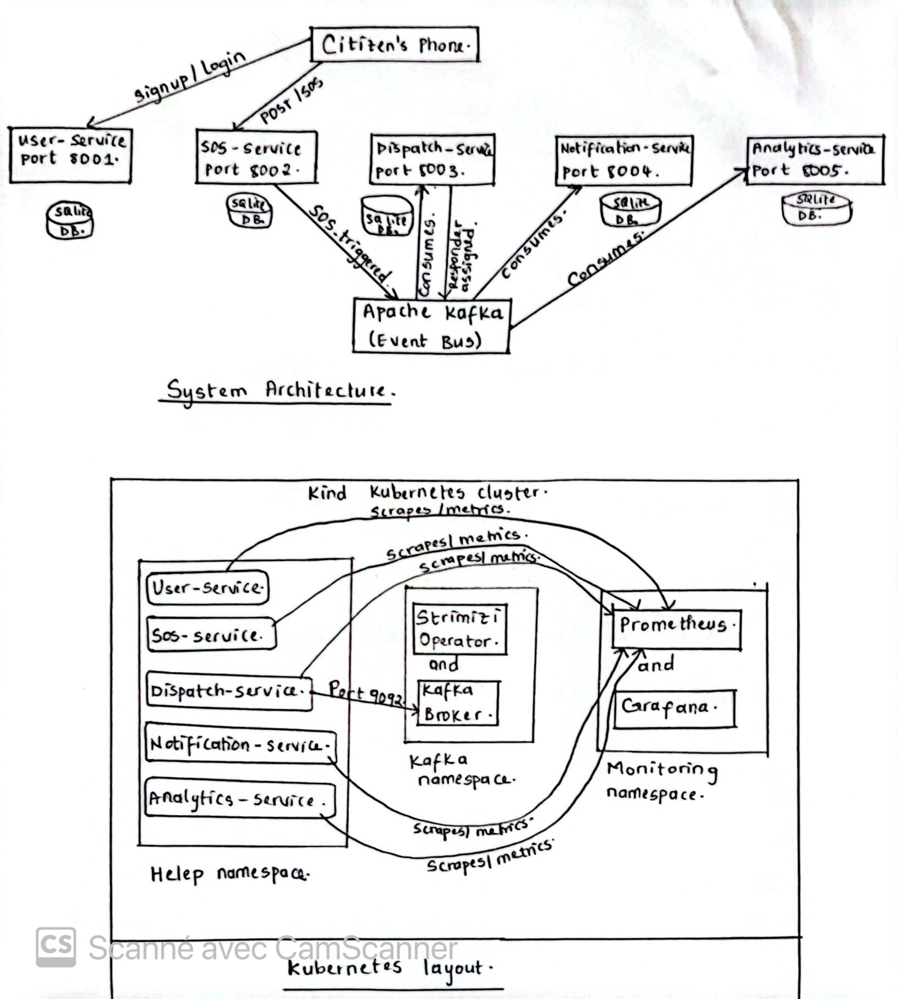
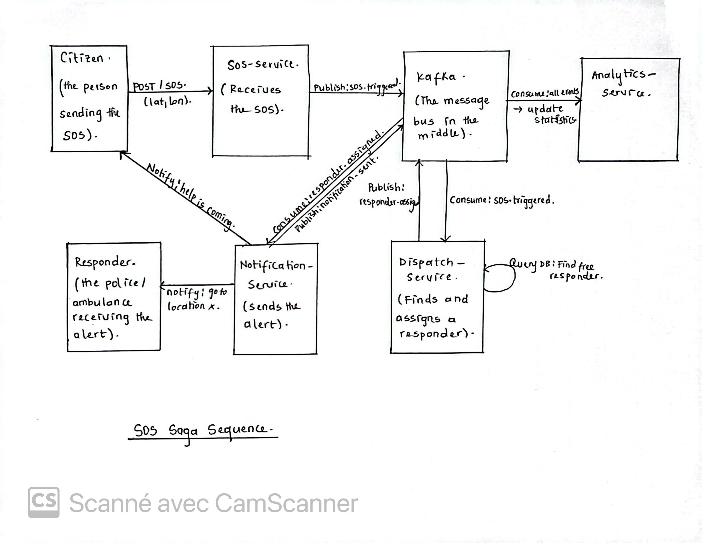

# Design Process Document – HELEP

---

## 1. Project Specification

HELEP stands for Help Emergency Location and Protection. The problem it solves
is simple: in Cameroon, when someone is in danger, getting help takes too long.
You call a number, hope someone picks up, try to explain where you are while
panicking, and wait. HELEP removes all of that. A citizen presses one button,
the system reads their GPS, finds the closest free responder, sends them to the
location, and notifies everyone involved without any human operator in the middle.

The people who use this system are citizens who need help, responders like police
officers and ambulance drivers who get dispatched to incidents, admins who monitor
what is happening in real time, and analysts who review incident data afterward.

---

## 2. Requirements Analysis

### 2.1 Functional Requirements

F1 - Citizens must be able to register and log in using their phone number and
a password.

F2 - An authenticated citizen must be able to send an SOS alert that includes
their GPS coordinates.

F3 - The system must automatically find the nearest available responder when
an SOS comes in.

F4 - The dispatch service must assign the responder to the incident and confirm
that assignment.

F5 - The notification service must alert both the citizen and the responder
once dispatch is done.

F6 - The analytics service must track all events flowing through the system
and expose live statistics through an API.

F7 - A responder must be able to confirm they are on their way or release the
assignment if needed.

F8 - The system must detect when an incident happens inside a predefined
danger zone and raise an alert.

### 2.2 Non-Functional Requirements

Availability: every service exposes a /healthz and a /readyz endpoint.
Kubernetes uses these to detect crashes and restart pods automatically. The
system should stay up even if individual pods fail.

Reliability: Kafka is configured with manual commit. The consumer only
commits an offset after the handler finishes successfully. This means an SOS
event is never lost, even if the service crashes halfway through processing it.

Scalability: each service has a Horizontal Pod Autoscaler that kicks in when
CPU usage crosses 70 percent, scaling up to 5 replicas. Because services are
independent, dispatch can scale without touching analytics.

Confidentiality: all citizen-facing endpoints require a JWT token. Credentials
like the JWT secret and Kafka password are stored in Kubernetes Secrets, not
hardcoded. NetworkPolicy restricts which services can talk to which.

Integrity: the dispatch service checks whether an assignment already exists
before doing anything. This prevents the same incident from being dispatched
twice even if the event is delivered more than once by Kafka.

Usability: FastAPI generates OpenAPI documentation automatically at /docs.
Every service has this without any extra work.

Compatibility: everything runs in Docker containers and is deployed through
Helm. It runs on any Kubernetes cluster version 1.28 or above.

### 2.3 Constraints

The SRS requires Kafka for all inter-service communication. This adds
operational complexity but we managed it using the Strimzi operator which
handles the Kafka cluster as a Kubernetes resource.

Each service uses its own SQLite database. SQLite only allows one writer at a
time which becomes a bottleneck under heavy load. For a prototype this is
acceptable but it is something that would need to change before going to
production.

The system must run on a local Kind cluster. This means Docker images cannot
be pulled from the internet during deployment. Every image has to be loaded
into Kind manually using kind load before the pods can start.

The stack is Python with FastAPI. Python's GIL limits true parallelism but we
worked around this by using async and await throughout every service so the
event loop never gets blocked.

---

## 3. Architecturally Significant Requirements

Three requirements shaped almost every decision in this project.

The first is speed. An emergency platform that responds slowly is not useful.
This is why we did not chain services together with direct HTTP calls. If
dispatch-service was slow, the whole chain would stall and the citizen would
get no response. With Kafka, sos-service publishes the event and immediately
moves on. Dispatch picks it up when it is ready. Nothing waits for anything else.

The second is integrity around dispatch. The same incident must never be
dispatched to two responders. This drove the idempotency check inside
dispatch-service and the Circuit Breaker we built around the database
operations. If the database starts failing, the circuit opens and stops the
service from retrying in a way that could create duplicate assignments.

The third is independent scalability. Analytics traffic should never affect
SOS processing. This is the core reason we split everything into five separate
services, gave each one its own database, and built the Helm chart so that
each service is its own subchart that can be scaled or redeployed without
touching the others.

---

## 4. Component Identification

The SRS describes several responsibilities: user management, SOS ingestion,
responder matching, dispatch and assignment, multi-channel notification, event
analytics, and danger zone detection. We mapped these to five services.

user-service handles registration, login, and JWT token generation. These all
belong to the same concern so there was no reason to split them.

sos-service handles SOS creation and the danger zone check. The zone check
happens at the exact moment an SOS is created so keeping them together made
sense. Separating them would have required an extra round trip with no benefit.

dispatch-service handles responder matching, database reservation, and the
circuit breaker logic. All three operations read and write the same responder
state. Splitting them would have required a distributed transaction which adds
complexity without any architectural gain.

notification-service handles SMS, push, and email delivery. All three channels
consume the same Kafka event. The Strategy pattern picks the right channel at
runtime based on configuration.

analytics-service is read-only. It consumes every event and updates counters.
Keeping it completely separate means it can never slow down or interfere with
the operational services no matter how much query traffic it receives.

---

## 5. Architectural Style

We used microservices with an event-driven approach as required by the SRS.

A monolith would honestly have been faster to build. No Kafka, no inter-service
networking, no Helm charts. Everything in one process. But the moment you need
to scale dispatch without also scaling analytics, you are completely stuck.
For a system where different parts have very different load profiles, a monolith
just does not fit.

The other option we considered was keeping the microservices but using
synchronous HTTP calls between them instead of Kafka. This feels simpler at
first. But the problem shows up the moment one service is slow or down. If
dispatch-service takes three seconds to respond, sos-service waits three
seconds before it can return anything to the citizen. If dispatch-service
crashes entirely, that SOS event is gone. Kafka solves both problems. The
event stays in the topic until the consumer is ready. If the consumer crashes
and restarts, it picks up exactly where it left off. That kind of resilience
is exactly what an emergency platform needs.

---

## 6. Patterns Used

The full code citations are in patterns-template.md. Here is a summary.

The Choreographed Saga pattern coordinates the multi-step SOS flow across
sos-service, dispatch-service, and notification-service without any central
coordinator. Each service reacts to an event and publishes the next one.

Pub/Sub via Kafka is used across all five services through events.py. Services
publish and consume topics without knowing anything about each other.

The Repository pattern is used in db.py in every service. All database logic
lives there. Route handlers never touch SQLite directly.

The Strategy pattern is in dispatch-service/matching.py. The responder matching
algorithm is swappable at runtime using the MATCHER environment variable without
changing any other code.

The Outbox-lite pattern appears in sos-service/main.py in the trigger function.
It makes the SOS creation and the Kafka publish feel like one atomic operation.

The Circuit Breaker is in dispatch-service/circuit_breaker.py. It wraps the
three critical database operations and stops failures from cascading if the
database starts misbehaving.

Health Endpoints exist on every service at /healthz and /readyz. Kubernetes
uses these for liveness and readiness checks.

The Sidecar pattern via Prometheus is used across all services at /metrics.
Metrics are collected without modifying any application logic.

---

## 7. Architecture Decision Records

### ADR-001: Use incident_id as the Kafka partition key

When we first set up Kafka we did not think about key selection. Then we
realised that if a cancellation event lands on a different partition than the
original trigger, it could be processed first and leave the system in a broken
state. The fix was to pass incident_id as the message key when publishing.
Kafka guarantees that all messages with the same key go to the same partition
so ordering per incident is now guaranteed.

The alternative was random partitioning which spreads load evenly but completely
breaks event ordering. Using user_id was another option but a user can have
multiple incidents and grouping unrelated incidents on the same partition serves
no purpose.

If this system grew to production scale the risk would be hot partitions if
one incident generates an unusual volume of events. For now that is acceptable.

---

### ADR-002: SQLite per service instead of a shared database

The easiest storage option would have been one shared Postgres database that
all services connect to. It would have made cross-service queries simple.

We chose to give each service its own SQLite file on its own PVC instead.
No service ever reads or writes another service's database. If data needs to
cross a service boundary it travels as a Kafka event.

This means we cannot do joins across services. Each service can change its
schema without coordinating with the others which is exactly the kind of
independence microservices are supposed to provide. SQLite is not ideal under
high write concurrency but for a prototype running on a laptop it works fine.

Per-service Postgres would be the production answer. For this scope it was
too operationally heavy to justify.

---

### ADR-003: Helm umbrella chart instead of five separate charts

All five services share configuration. The Kafka bootstrap address, the JWT
secret, and the image pull policy are the same for everyone. If we had five
separate charts we would be copying and pasting the same values five times and
updating them five times every time something changed.

We built one umbrella chart with five subcharts. Shared values live in the
root values.yaml and flow down into every subchart automatically. One command
deploys the entire system.

The trade-off is that deploying just one service in isolation requires using
helm upgrade with specific set flags rather than a clean standalone install.
That is a reasonable trade-off for the simplicity it gives during development.

Kustomize was a valid alternative but it has less flexibility for this kind
of parameterisation. Five separate charts would give more isolation but much
more repetition.

---

## 8. Diagrams

### System Architecture

This diagram shows the five services with their port numbers, the SQLite
database sitting under each one, and Apache Kafka in the middle connecting
everything. The citizen's phone only communicates directly with user-service
and sos-service. All other interactions happen through Kafka events.

The second part of the diagram shows the Kubernetes layout with the three
namespaces: helep where the services run, kafka where Strimzi and the broker
live, and monitoring where Prometheus and Grafana collect metrics from
everything.

### SOS Saga Sequence

This diagram traces one emergency from start to finish. The citizen sends the
SOS, sos-service publishes the event to Kafka, dispatch-service picks it up
and queries the database to find a free responder, publishes the assignment,
notification-service picks that up and sends alerts to both the citizen and
the responder, then publishes the final confirmation. Analytics-service
consumes every event along the way and updates the statistics.

Nothing in this flow is synchronous. Each service only reacts to what arrives
in its topic and publishes what comes next.

---

## 9. Weaknesses and What I Would Fix

The first weakness is SQLite under real load. SQLite blocks concurrent writes.
If hundreds of SOS alerts came in at the same time, dispatch-service would
start queuing writes and slowing down noticeably. Replacing it with PostgreSQL
and an async driver like asyncpg would solve this and nothing outside of db.py
would need to change.

The second weakness is the single Kafka broker. Right now if the broker goes
down, no events flow and no SOS gets processed. Running three brokers with
replication factor 3 and min.insync.replicas set to 2 would let the cluster
survive a node failure without any interruption to service.

The third weakness is the lack of access control on Kafka topics. Any pod in
the cluster can currently write to any topic. A compromised service could
inject fake events into the saga. Enabling TLS listeners through Strimzi with
SASL authentication and adding per-service ACLs would fix this. Each service
would only be allowed to interact with the specific topics it actually needs.

---